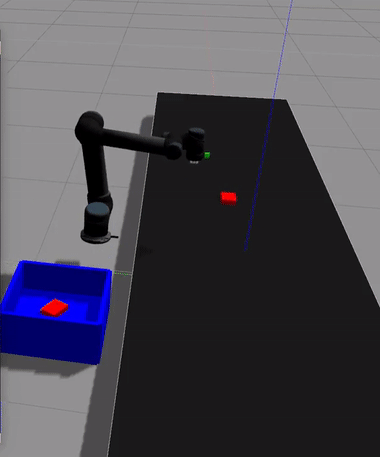

# Robotics Engineer & Hardware Specialist

> *Building intelligent force-sensitive systems for next-generation robotics*

## What I Build

**Gazebo Harmonic Vacuum Gripper Plugin**  
*Advanced simulation tooling for robotic manipulation research*

**Force-Sensitive Hardware Systems**  
Freelance hardware engineer specializing in custom sensor solutions that accelerate R&D for force-sensitive applications across industries.

**R&D Acceleration**  
Transforming experimental concepts into reliable, production-ready sensing systems.

## Current Mission

**High-Performance LiDAR Odometry**  
*Real-time localization systems for autonomous mobile robots*
  

Developing optimized algorithms for precise robot localization in GPS-denied environments, focusing on computational efficiency and accuracy for real-world deployment.

## Focus Areas

- **Hardware Development**: Custom sensor design and integration
- **Precision Engineering**: High-fidelity force measurement systems
- **Autonomous Systems**: Mobile robot navigation and perception
- **Algorithm Optimization**: Real-time performance-critical applications

## Tech Stack

